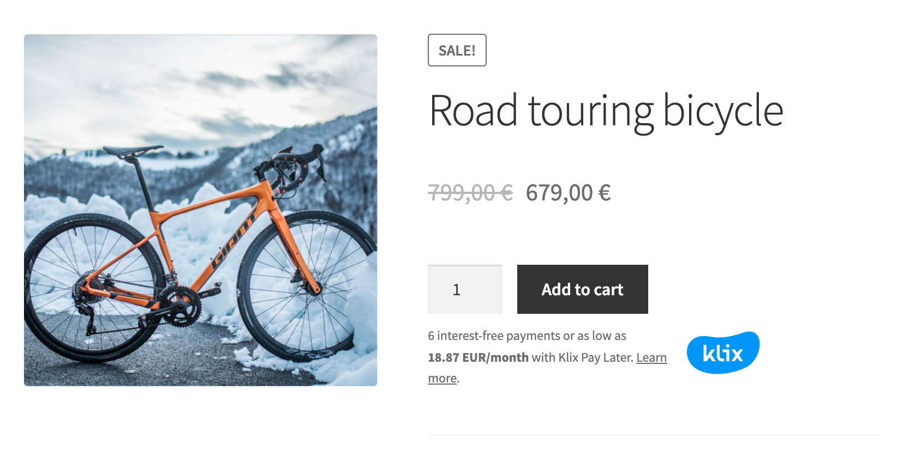

# Klix API

Klix provides unified API for multiple payment methods - card and PSD2 bank payments. Full up-to-date REST API Reference can be found [here](https://portal.klix.app/api). OpenAPI document that can be used to generate API client can be found [here](https://portal.klix.app/api/schema/v1/).
In order to call Klix API you should first receive API credentials (Brand ID and Secret Key) from Klix representative.

## API usage in single payment scenario

### Single payment step-by-step guide

1. Get list of payment methods (optional). This API end-point returns name and logo of each payment method available to merchant (Klix Card payments, Citadele and other bank PSD2 payments etc.). Use this list to render a payment methods page on your site.
2. Create a purchase by submitting order data to Klix. Once purchase is created link to Klix hosted payment page will be returned as `checkout_url` field value. After customer is redirected to this page Klix will handle the payment process.
3. Handle one of possible payment process outcomes:
    * If customer payment is successful then callback is sent to merchant server and customer is redirected to successful purchase page specified by merchant. Note that you should consider purchase as successfully paid only after callback is received and purchase status is checked. Note that in case if callback is not used you can call Klix API to get purchase status once customer is redirected back to successful purchase page.
    * If customer payment fails for some reason customer is redirected to failed purchase page.
    * If cancelled payment redirect URL is specified in purchase creation request then customer will be able to go back to merchant page from Klix payment page. It's preferable to specify checkout/payment method selection page as cancelled payment redirect URL so that customer can make adjustments in shopping cart or choose different payment method.

### Single payment request examples

These are simple request examples that illustrate Klix API usage. Always use [API Reference](https://portal.klix.app/api) as a single source of truth.
Note that `<Brand ID goes here>` and `<Secret key goes here>` should be replaced with actual `Brand ID` and `Secret Key` received from Klix contact person.

#### Get list of available payment methods

```sh
curl -X GET \
  'https://portal.klix.app/api/v1/payment_methods/?currency=EUR&brand_id=<Brand ID goes here>' \
  -H 'Accept: application/json' \
  -H 'Authorization: Bearer <Secret key goes here>' \
  -H 'Cache-Control: no-cache' \
  -H 'Connection: keep-alive' \
  -H 'Host: portal.klix.app' \
  -H 'accept-encoding: gzip, deflate' \
  -H 'cache-control: no-cache'
```

#### Create available payment methods purchase

This option allows to create a purchase that can be paid using any payment method available to merchant. Customer will be have an option to choose one of available payment methods after redirect to Klix payment page.

```sh
curl -X POST \
  https://portal.klix.app/api/v1/purchases/ \
  -H 'Accept: application/json' \
  -H 'Authorization: Bearer <Secret key goes here>' \
  -H 'Cache-Control: no-cache' \
  -H 'Connection: keep-alive' \
  -H 'Content-Type: application/json' \
  -H 'Host: portal.klix.app' \
  -H 'accept-encoding: gzip, deflate' \
  -H 'cache-control: no-cache' \
  -d '{
   "success_callback": "https://your.site/api/successfully-paid-callback-will-be-sent-to-this-end-point",
   "success_redirect": "https://your.site/customer-will-be-redirected-here-in-case-of-successfull-payment",
   "failure_redirect": "https://your.site/customer-will-be-redirected-here-in-case-of-failed-payment",
   "cancel_redirect": "https://your.site/customer-will-be-redirected-here-in-case-customer-decides-to-go-back-to-your-store-during-payment",
   "purchase": {
      "language": "lv",
      "products": [
         {
            "price": 3000,
            "name": "Xiaomi Mi Smart Band 5"
         },
         {
            "price": 100,
            "name": "Screen protector for Xiaomi Mi Smart Band 5"
         }
      ]
   },
   "client": {
      "email": "test@test.com"
   },
   "brand_id": "<Brand ID goes here>",
   "reference": "Your order id"
}'
```

#### Create whitelisted payment method purchase

This option allows to create a purchase that can be paid only using specified whitelisted payment method. Most often this option is used to allow purchase to be paid using payment method selected on merchant web-site.

```sh
curl -X POST \
  https://portal.klix.app/api/v1/purchases/ \
  -H 'Accept: application/json' \
  -H 'Authorization: Bearer <Secret key goes here>' \
  -H 'Cache-Control: no-cache' \
  -H 'Connection: keep-alive' \
  -H 'Content-Type: application/json' \
  -H 'Host: portal.klix.app' \
  -H 'accept-encoding: gzip, deflate' \
  -H 'cache-control: no-cache' \
  -d '{
   "success_callback": "https://your.site/api/successfully-paid-callback-will-be-sent-to-this-end-point",
   "success_redirect": "https://your.site/customer-will-be-redirected-here-in-case-of-successfull-payment",
   "failure_redirect": "https://your.site/customer-will-be-redirected-here-in-case-of-failed-payment",
   "cancel_redirect": "https://your.site/customer-will-be-redirected-here-in-case-customer-decides-to-go-back-to-your-store-during-payment",
   "purchase": {
      "language": "lv",
      "products": [
         {
            "price": 3000,
            "name": "Xiaomi Mi Smart Band 5"
         },
         {
            "price": 100,
            "name": "Screen protector for Xiaomi Mi Smart Band 5"
         }
      ]
   },
   "client": {
      "email": "test@test.com"
   },
   "payment_method_whitelist": ["klix"],
   "brand_id": "<Brand ID goes here>",
   "reference": "Your order id"
}'
```

#### Get purchase information

`<Purchase ID>` is purchase identifier (field `id` value) received in purchase creation response.

```sh
curl -X GET \
  https://portal.klix.app/api/v1/purchases/<Purchase ID>/ \
  -H 'Accept: application/json' \
  -H 'Authorization: Bearer <Secret key goes here>' \
  -H 'Cache-Control: no-cache' \
  -H 'Connection: keep-alive' \
  -H 'Host: portal.klix.app' \
  -H 'accept-encoding: gzip, deflate' \
  -H 'cache-control: no-cache'
```

## API usage in recurring payment scenario

### Recurring payment step-by-step guide

1. Create an initial purchase with recurring flag set to `true` (see `"force_recurring": true` in [example](#create-an-initial-purchase-to-register-card-for-subsequent-recurring-payments)) in order to register payment card details for subsequent use in recurring payments. Created purchase `id` and `checkout_url` will be returned in a response. Redirect customer to `checkout_url` and Klix will handle the payment process. Store this initial purchase `id` on your side as a recurring payment token and use it later on to charge a customer payment card (see `<Recurring payment token>` placeholder in [example](#charge-customer-card-as-a-recurring-payment)). If purchase created in previous step is paid by customer then card details are successfully captured for subsequent use.
2. Once customer card should be charged in a form of a recurring payment new purchase should be created via API by specifying amount that needs to be charged and transaction description. This time `force_recurring` should be `false` or can be omitted at all (see [example](#create-recurring-payment)). In this case only purchase `id` returned in response should be used in next step (see `<Purchase id of recurring payment>` placeholder in [example](#charge-customer-card-as-a-recurring-payment)). Note that `checkout_url` should not be used.
3. Created purchase should be charged via API call. Note that both newly created purchase `id` created in step 2 and recurring payment token (purchase `id`) created in step 1 should be passed to this API end-point (see [example](#charge-customer-card-as-a-recurring-payment)).

### Recurring payment request examples

These are simple request examples that illustrate Klix API usage. Always use [API Reference](https://portal.klix.app/api) as a single source of truth.
Note that `<Brand ID goes here>` and `<Secret key goes here>` should be replaced with actual `Brand ID` and `Secret Key` received from Klix contact person.

#### Create an initial purchase to register card for subsequent recurring payments

This should be done only once to make initial payment and register customer card for subsequent use.

```sh
curl -X POST \
  https://portal.klix.app/api/v1/purchases/ \
  -H 'Accept: application/json' \
  -H 'Authorization: Bearer <Secret key goes here>' \
  -H 'Cache-Control: no-cache' \
  -H 'Connection: keep-alive' \
  -H 'Content-Type: application/json' \
  -H 'Host: portal.klix.app' \
  -H 'accept-encoding: gzip, deflate' \
  -H 'cache-control: no-cache' \
  -d '{
   "force_recurring": true,
   "success_callback": "https://your.site/api/successfully-paid-callback-will-be-sent-to-this-end-point",
   "success_redirect": "https://your.site/customer-will-be-redirected-here-in-case-of-successfull-payment",
   "failure_redirect": "https://your.site/customer-will-be-redirected-here-in-case-of-failed-payment",
   "cancel_redirect": "https://your.site/customer-will-be-redirected-here-in-case-customer-decides-to-go-back-to-your-store-during-payment",
   "purchase": {
      "language": "lv",
      "products": [
         {
            "price": 700,
            "name": "XYZ service subscription"
         }
      ]
   },
   "client": {
      "email": "test@test.com"
   },
   "brand_id": "<Brand ID goes here>",
   "reference": "Your order id"
}'
```

#### Create recurring payment

This should be done for each recurring payment (e.g. each month).

```sh
curl -X POST \
  https://portal.klix.app/api/v1/purchases/ \
  -H 'Accept: application/json' \
  -H 'Authorization: Bearer <Secret key goes here>' \
  -H 'Cache-Control: no-cache' \
  -H 'Connection: keep-alive' \
  -H 'Content-Type: application/json' \
  -H 'Host: portal.klix.app' \
  -H 'accept-encoding: gzip, deflate' \
  -H 'cache-control: no-cache' \
  -d '{
   "success_callback": "https://your.site/api/successfully-paid-callback-will-be-sent-to-this-end-point",
   "purchase": {
      "language": "lv",
      "products": [
         {
            "price": 700,
            "name": "XYZ service subscription fee for December 2020"
         }
      ]
   },
   "client": {
      "email": "test@test.com"
   },
   "brand_id": "<Brand ID goes here>",
   "reference": "Your order id"
}'
```

#### Charge customer card as a recurring payment

```sh
curl -X POST \
  https://portal.klix.app/api/v1/purchases/<Purchase id of recurring payment>/charge \
  -H 'Accept: application/json' \
  -H 'Authorization: Bearer <Secret key goes here>' \
  -H 'Cache-Control: no-cache' \
  -H 'Connection: keep-alive' \
  -H 'Content-Type: application/json' \
  -H 'Host: portal.klix.app' \
  -H 'accept-encoding: gzip, deflate' \
  -H 'cache-control: no-cache' \
  -d '{
   "recurring_token": "<Recurring payment token>"
}'
```

## API usage in reservation scenario (payment execution separated from authorization)

### Reservation step-by-step guide

1. Create a purchase by submitting order data and additional `skip_capture` flag to Klix indicating card payment authorization separation from payment execution. Once purchase is created link to Klix hosted payment page will be returned as `checkout_url` field value. Payment identifier returned in purchase creation response should be stored for later use in capture or release requests. After customer is redirected to this page Klix will capture customer card details and will reserve the funds equal to purchase total amount.
2. There are two options how to proceed with reservation:
    * Capture reserved amount. There's an option to capture either full reserved amount or amount that's smaller than initially reserved amount.
    * Release (return to customer) reserved amount.

!!! Warning "Automatic release of reserved amount"
    Reservations are released automatically after 6 days if capture request is not received within this period.

### Reservation functionality request examples

These are simple request examples that illustrate Klix API usage. Always use [API Reference](https://portal.klix.app/api) as a single source of truth.
Note that `<Brand ID goes here>` and `<Secret key goes here>` should be replaced with actual `Brand ID` and `Secret Key` received from Klix contact person.

#### Create a reservation purchase

This option allows to create a purchase that will reserve purchase total amount in case of card payment. Store purchase `id` returned in response to either capture or release funds reserved by this purchase. Redirect customer to `checkout_url` returned in purchase creation response to allow customer to enter card details. Note that in case of successful reservation purchase status will be changed to "hold" instead of "paid" as in case of regular card payment.

```sh
curl -X POST \
  https://portal.klix.app/api/v1/purchases/ \
  -H 'Accept: application/json' \
  -H 'Authorization: Bearer <Secret key goes here>' \
  -H 'Cache-Control: no-cache' \
  -H 'Connection: keep-alive' \
  -H 'Content-Type: application/json' \
  -H 'Host: portal.klix.app' \
  -H 'accept-encoding: gzip, deflate' \
  -H 'cache-control: no-cache' \
  -d '{
   "success_callback": "https://your.site/api/successfully-paid-callback-will-be-sent-to-this-end-point",
   "success_redirect": "https://your.site/customer-will-be-redirected-here-in-case-of-successfull-payment",
   "failure_redirect": "https://your.site/customer-will-be-redirected-here-in-case-of-failed-payment",
   "cancel_redirect": "https://your.site/customer-will-be-redirected-here-in-case-customer-decides-to-go-back-to-your-store-during-payment",
   "purchase": {
      "language": "lv",
      "products": [
         {
            "price": 3000,
            "name": "Xiaomi Mi Smart Band 5"
         },
         {
            "price": 100,
            "name": "Screen protector for Xiaomi Mi Smart Band 5"
         }
      ]
   },
   "skip_capture": true,
   "client": {
      "email": "test@test.com"
   },
   "payment_method_whitelist": ["klix"],
   "brand_id": "<Brand ID goes here>",
   "reference": "Your order id"
}'
```

#### Capture funds reserved by previously created purchase

To capture full amount previously reserved by specified purchase no request body should be sent. `<Purchase ID>` is purchase identifier (field `id` value) received in purchase creation response.

```sh
curl --location --request POST 'https://portal.klix.app/api/v1/purchases/<Purchase ID>/capture/' \
--header 'Content-Type: application/json' \
--header 'Authorization: Bearer <Secret key goes here>'
```

#### Capture partial funds reserved by previously created purchase

To capture amount that's smaller than previously reserved amount this new amount should be specified in request. `<Purchase ID>` is purchase identifier (field `id` value) received in purchase creation response.

```sh
curl --location --request POST 'https://portal.klix.app/api/v1/purchases/<Purchase ID>/capture/' \
--header 'Content-Type: application/json' \
--header 'Authorization: Bearer <Secret key goes here>' \
--data-raw '{
    "amount": 5
}
'
```

#### Release funds reserved by previously created purchase

To release funds reserved by Purchase following request should be sent:

```sh
curl --location --request POST 'https://portal.klix.app/api/v1/purchases/<Purchase ID>/release/' \
--header 'Content-Type: application/json' \
--header 'Authorization: Bearer <Secret key goes here>'
```

## API usage in recurring payment & reservation scenario

Recurring payment & reservation scenario combines recurring payment and reservation scenarios - after customer performs initial card registration for recurring payments merchant can use this card for reserving initial amount and then either charging exact amount that's not greater than initially reserved amount or releasing reservation.

### Recurring payment & reservation step-by-step guide

1. Create an initial purchase with recurring flag set to `true` (see `"force_recurring": true` in [example](#create-an-initial-purchase-to-register-card-for-subsequent-recurring-payments)) in order to register payment card details for subsequent use in recurring payments. Created purchase `id` and `checkout_url` will be returned in a response. Redirect customer to `checkout_url` and Klix will handle the payment process. Store this initial purchase `id` on your side as a recurring payment token and use it later on to reserve initial amount (see `<Recurring payment token>` placeholder in [example](#reserve-recurring-payment-initial-amount)). If purchase created in this step is paid by customer then card details are successfully captured for subsequent use.
2. Create a new purchase once recurring purchase amount should be reserved. Additional `skip_capture` flag (see [example request](#create-recurring-payment-for-reservation)) should be added in request indicating card payment authorization separation from payment execution. Once purchase is created payment identifier returned in response should be stored for later use in a charge request. In this case only purchase `id` returned in response should be used in next step (see `<Purchase id of recurring payment>` placeholder in [example](#reserve-recurring-payment-initial-amount)). Note that `checkout_url` should not be used.
3. Make charge API call to perform actual reservation of recurring payment initial amount. Note that both newly created purchase `id` created in step 2 and recurring payment token (purchase `id`) created in step 1 should be passed to this API end-point (see [example](#reserve-recurring-payment-initial-amount)).
4. There are two options how to proceed with recurring payment reservation:
    * Capture reserved amount. There's an option to capture either full reserved amount or amount that's smaller than initially reserved amount.
    * Release (return to customer) reserved amount.

### Recurring payment & reservation request examples

These are simple request examples that illustrate Klix API usage. Always use [API Reference](https://portal.klix.app/api) as a single source of truth.
Note that `<Brand ID goes here>` and `<Secret key goes here>` should be replaced with actual `Brand ID` and `Secret Key` received from Klix contact person.

#### [Create an initial purchase to register card for subsequent recurring payments](#create-an-initial-purchase-to-register-card-for-subsequent-recurring-payments)

Create an initial purchase for card registration in a same way it's done in a regular recurring payment scenario.

#### Create recurring payment for reservation

This should be done for each recurring transaction (e.g. to reserve some predefined amount before electric car charge is started). 

```sh
curl -X POST \
  https://portal.klix.app/api/v1/purchases/ \
  -H 'Accept: application/json' \
  -H 'Authorization: Bearer <Secret key goes here>' \
  -H 'Cache-Control: no-cache' \
  -H 'Connection: keep-alive' \
  -H 'Content-Type: application/json' \
  -H 'Host: portal.klix.app' \
  -H 'accept-encoding: gzip, deflate' \
  -H 'cache-control: no-cache' \
  -d '{
   "success_callback": "https://your.site/api/successfully-paid-callback-will-be-sent-to-this-end-point",
   "purchase": {
      "language": "lv",
      "products": [
         {
            "price": 5000,
            "name": "Electric car charge"
         }
      ]
   },
   "client": {
      "email": "test@test.com"
   },
   "skip_capture": "true",
   "brand_id": "<Brand ID goes here>",
   "reference": "Your order id"
}'
```

#### Reserve recurring payment initial amount

Note that in case of successful reservation recurring purchase status will be changed to "hold" instead of "paid" as in case of regular card payment.

```sh
curl -X POST \
  https://portal.klix.app/api/v1/purchases/<Purchase id of recurring payment>/charge \
  -H 'Accept: application/json' \
  -H 'Authorization: Bearer <Secret key goes here>' \
  -H 'Cache-Control: no-cache' \
  -H 'Connection: keep-alive' \
  -H 'Content-Type: application/json' \
  -H 'Host: portal.klix.app' \
  -H 'accept-encoding: gzip, deflate' \
  -H 'cache-control: no-cache' \
  -d '{
   "recurring_token": "<Recurring payment token>"
}'
```

#### [Capture funds reserved by previously created purchase](#capture-funds-reserved-by-previously-created-purchase)

Note that after successful capture recurring purchase status is changed to "paid".

#### [Capture partial funds reserved by previously created purchase](#capture-partial-funds-reserved-by-previously-created-purchase)

Note that after successful capture recurring purchase status is changed to "paid".

#### [Release funds reserved by previously created purchase](#release-funds-reserved-by-previously-created-purchase)

Note that after successful capture recurring purchase status is changed to "released".


## Klix Pay Later monthly payment widget

In order to add Klix Pay Later monthly payment widget to your store place following script in head part of the page.

```html
<head>
   <!-- Klix Pay Later widget -->
   <script type="module" src="https://klix.blob.core.windows.net/public/pay-later-widget/build/klix-pay-later-widget.esm.js"></script>
   <script nomodule="" src="https://klix.blob.core.windows.net/public/pay-later-widget/build/klix-pay-later-widget.js"></script>
</head>
```

Then place Klix Pay Later monthly payment widget source code just below the product price. You should pass at least product price, language and your Brand ID to widget.

```html
<body>
   ...
   <klix-pay-later amount="67900" brand_id="702314b8-dd86-41fa-9a22-510fdd71fa92" 
      language="en" theme="light" view="product" category="SPORTS_GOODS">
   </klix-pay-later>
   ...
</body>
```

For Shopify integration:

```html
<body>
   ...
   <klix-pay-later amount="{{ product.price | money_numbers_only}}" brand_id="702314b8-dd86-41fa-9a22-510fdd71fa92" 
      language="en" theme="light" view="product" category="SPORTS_GOODS">
   </klix-pay-later>
   ...
</body>
```



!!! Note "We strongly recommend to place Klix Pay Later monthly payment widget both on product, shopping cart and checkout page so that customer can preview monthly payment also if multiple different products are added to the shopping cart."

Previously mentioned widget code example will result in the following widget.

<!-- markdownlint-disable MD033 -->
<div>
<div style="padding-bottom:10px">
<klix-pay-later amount="67900" brand_id="afe15e54-d9cb-4c2a-ab04-10ff9e9625be" language="en" theme="light" view="product" category="SPORTS_GOODS" class="hydrated">
</klix-pay-later>
</div>
<klix-pay-later amount="67900" brand_id="3709bfbf-9210-40cd-b6bc-dfc46a20c12e" language="lt" theme="light" view="cart" category="SPORTS_GOODS" class="hydrated">
</klix-pay-later>
</div>
<!-- markdownlint-disable MD033 -->

Widget parameters are described in the following table.

| Parameter      | Description                                                                                                                             | Optional |
|----------------|-----------------------------------------------------------------------------------------------------------------------------------------|----------|
| `amount`       | Product price in cents (if widget is shown in product view)/shopping cart item total amount in cents (if widget is shown in shopping cart/checkout view)  | false    |
| `brand_id`     | Brand ID assigned to your company after Klix agreement signing                                                                          | false    |
| `language`     | Widget language ( Latvia "en", "lv", "ru", Lithuania: "lt")                                  | false    |
| `theme`        | Currenly only "light" theme is supported                                                                                                | true     |
| `view`         | Widget placement in site. Following placements are supported: "product", "cart", "checkout".                                            | true     |
| `category`     | Product category. Should be specified only in case merchant sells different type of goods. Possible values: TV_HOME_APPLIANCES, CLOTHES_SHOES_ACCESSORIES, ELECTRONICS, COMPUTER_EQUIPMENT, FURNITURE, SPORTING_GOODS, GARDEN_GOODS, COSMETICS, CHILDREN_GOODS, CAR_GOODS, MOTO_GOODS, FOR_HOME_AND_REPAIR, ZOO_GOODS, GROCERIES_AND_ALCOHOL, BOOKS, MEDICAL_GOODS, GIFT_CARDS, DELIVERY, OTHER                                                                                                                       | true     |
