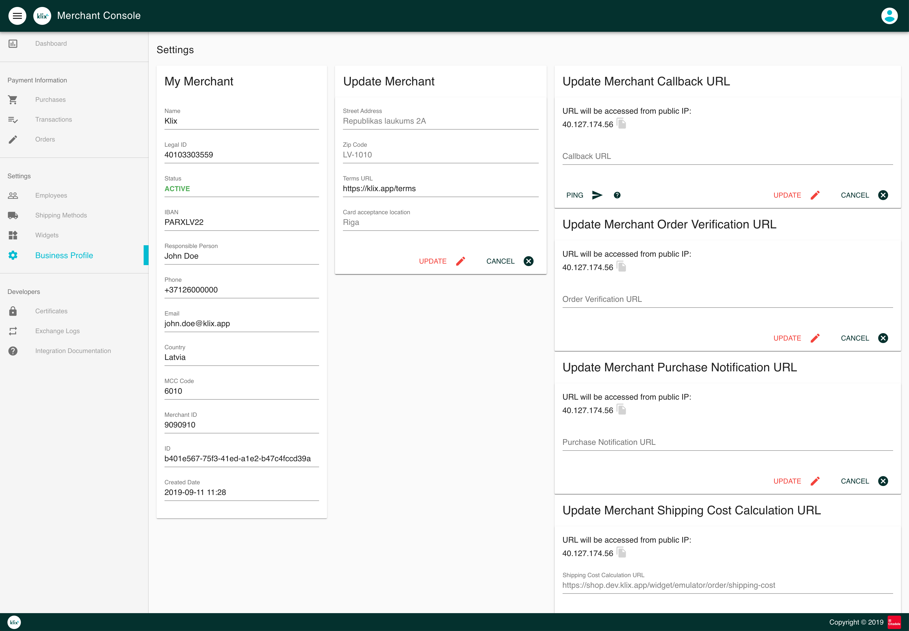
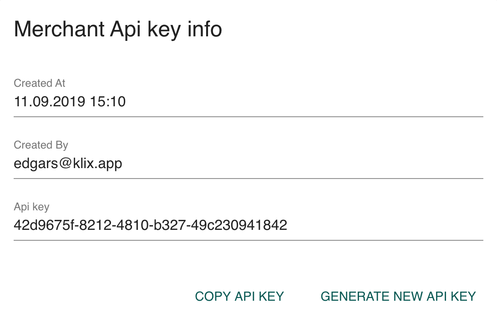
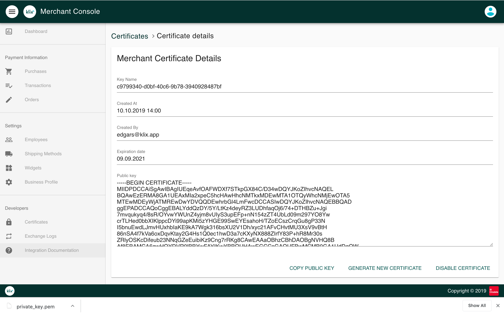

# Integration configuration

Integration configuration is done in Klix Merchant Console. After logging in Merchant Console follow these steps to configure Klix integration.

## 1. Complete the merchant profile in Merchant Console

Fill in merchant data in "Business Profile view". Specify URL to merchant's terms & conditions. Specify [callback URLs](../callbacks/) in case advanced integration (API & callbacks based) is used.

## 2. Download Klix public key

Head to Certificates page and copy public key contents from "Service Provider Certificate info" section. Store public key contents in file and use this key to validate the Klix callback payload.

## 3. Store API key

For each HTTP request sent to Klix header called `X-KLIX-Api-Key` should be specified. Header value can be obtained from Certificates page "Merchant Api key info" section.

## 4. Generate certificate for signing the API requests

Generate certificate and download private key file. Data modification requests sent to Klix should be signed using this key.

!!! Warning "Please note"
    Field `API Key` value should be specified as JWS header `kid` value.

## 5. Create a widget

Head to Widgets section to create a new widget. Klix widget is Klix form configuration representation that is identifiable by it's id. There are two types of widgets:

* Static widget
* Dynamic widget

See [Widget](../widget/) section for more detailed description of widget types amd configuration.
