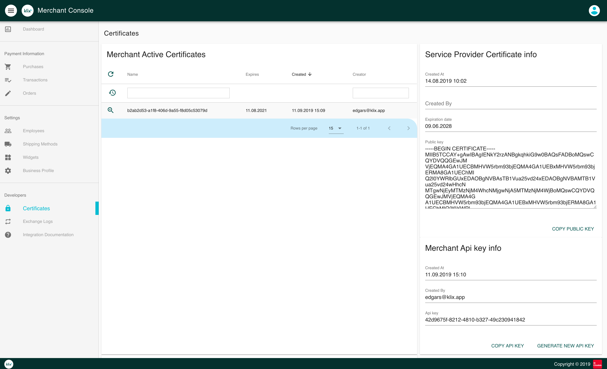

# Integration configuration

Integration configuration is done in Klix Merchant Console. After logging in Merchant Console follow these steps to configure Klix integration.

## 1. Complete the merchant profile in Merchant Console

Fill in merchant data in "Business Profile view". Specify URL to merchant's terms & conditions. Specify [callback URLs](../callbacks/) in case advanced integration (API & callbacks based) is used.

## 2. Download Klix public key

Head to Certificates page and copy public key contents from "Service Provider Certificate info" section.

Store public key contents in file and use this key to [validate](../callbacks/#callback-payload-signature-validation) the Klix callback payload signature.

!!! Warning "Callback payload signature validation"
    Merchant is obligated to perform Klix callback payload signature validation using Klix public key in order to ensure request payload integrity and authenticity.

## 3. Generate private/public key pair for signing the API requests

Generate private/public key pair and download private key file. Merchant order details passed as Klix widget attributes and all data modification requests sent to Klix API e.g. payment refund should be signed using this private key. Klix will use merchant certificate public key to check each data modification request payload integrity and authenticity. In order to understand which merchant's certificate should be used to validate a HTTP request payload HTTP header `X-Klix-Key-ID` value should be specified. Header value can be obtained from Certificates page corresponding certificate's field "Name".

!!! Warning "Security notice"
    Merchant is reponsible for storing certificate's private key securely. Merchant can generate a new certificate in Merchant Console and use this certificate to sign request payload and widget attrributes. Note that in such case HTTP header `X-Klix-Key-ID` value and Klix widget attribute `certificate-name` should match new certificate's name.

## 4. Create a widget

Head to Widgets section to create a new widget. Klix widget is Klix form configuration representation that is identifiable by it's id. There are tree types of widgets:

* Static widget
* Klix Pay widget
* Klix Checkout widget

See [Widget](../widget/) section for more detailed description of widget types and configuration.

## 5. Store API key

Note that Klix standard checkout flow doesn't require a merchant to invoke Klix API. More advanced use cases like refunding an order can be handled both in Merchant Console or via Klix API. For each HTTP request sent to Klix API HTTP header called `X-KLIX-Api-Key` should be specified. Header value can be obtained from Certificates page "Merchant Api key info" section's field "Api key".

