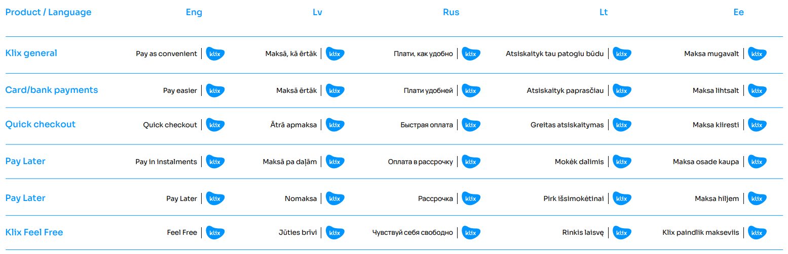
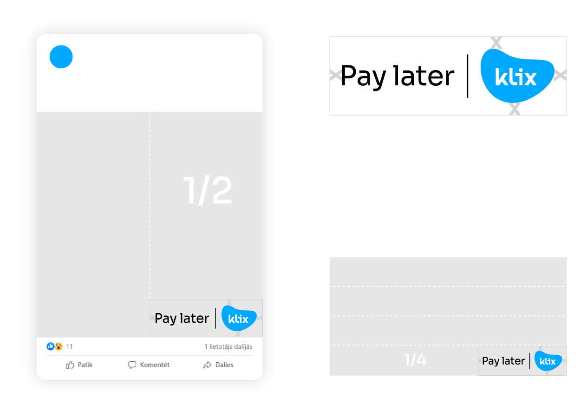

# Advertising guidelines

Here are little tips & tricks to make sure you get best out of Klix. Klix has exponentially growing user amount month-over-month, becoming one of the most important payment methods in Baltics. Make sure you grasp this audience by showing them something they love about shopping - Klix!

Please read through these guidelines, as they contain various materials and are intended to help you stay compliant while representing Klix brand.

## Advertising with Klix

We encourage you to use Klix lock-ups on your banners. This way your audience will know that they can pay without a hassle in your shop. 

Only ever use Klix approved lock-ups  ([download here](https://drive.google.com/uc?export=download&id=1HP4jWwJI1paHzRX5HK5cq2aQHIpq684n)). Choose one or several options, whichever suits your communication best. There are generic lock-ups as well as product descriptive lock-ups. Here is a table for better understanding. 

Make sure you follow simple rules, like in examples bellow. Always use Klix lock-up with clear space around. In horizontal banners the height of Klix lockup should be defined in certain proportion like 1/2, 1/3, 1/4 etc.The minimum height should not be less then 50px.

## Klix marketing materials 

Just like any other good news, share info about Klix to your audience on your website, newsletters and social media. We've prepared everything for you, feel free to use it. 

** Materials in LV, RUS and ENG languages for LATVIAN market. **

| Where to use | Visuals | How to use |
|-----|------|-----|
| 1. Main page banner on your website if you have “Klix Pay Later bezprocentu nomaksa” product.   *If you are not sure which Klix Pay Later product you have, contact your Klix account manager to specify. | [Download here](https://drive.google.com/uc?export=download&id=1eSLoKCmzMptly1iGp-AVWkgVHE-hGIUK) | Make sure users get information about what Klix offers right away. Keep informative Klix banner on main page banner rotation. You can change and use several of options. Make sure to link banner to informative Klix landing page, so your users can read more, if they have questions. If you have to adjust size, in this folder, there is photoshop file which you can edit. |
| 2. Main page banner on your website if you have “Klix Pay Later bez ikmēneša %” product.   *If you are not sure which Klix Pay Later product you have, contact your Klix account manager to specify. | [Download here](https://drive.google.com/uc?export=download&id=1-Kw9u0m_8goE4ZuKZNePTeg4qbLO3isf) | Make sure users get information about what Klix offers right away. Keep informative Klix banner on main page banner rotation. You can change and use several of options. Make sure to link banner to informative Klix landing page, so your users can read more, if they have questions. If you have to adjust size, in this folder, there is photoshop file which you can edit. |
|3. Social media banners about Klix Pay  | [Download here](https://drive.google.com/uc?export=download&id=1rJAackncQQffi1GGfcaf-6ZsLF9lIsjg) | You are now part of Klix. Celebrate a little! Announce the good news to your followers. Explain how to and why to use Klix payments to your users through visuals.  |
|4. Social media banners if you have “Klix Pay Later bezprocentu nomaksa” product    *If you are not sure which Klix Pay Later product you have, contact your Klix account manager to specify. | [Donwload here](https://drive.google.com/uc?export=download&id=1xl1lJOOdF2M25Hmv2_BWhp-wb0UHJ-Zl) | You are now part of Klix. Celebrate a little! Announce the good news to your followers. Explain how to and why to use Klix Pay Later to your users through visuals. |
|5. Social media banners if you have “Klix Pay Later bez ikmēneša %” product  *If you are not sure which Klix Pay Later product you have, contact your Klix account manager to specify. | [Download here](https://drive.google.com/uc?export=download&id=1SX-TBj3IrOtHuBborcJjSd5WkvOUQAVA) | To make sure your users understand how to use Klix Pay Later, we will soon prepare short video instruction. |
|6. Klix Pay Later video instruction | Coming soon | To make sure your users understand how to use Klix Pay Later, we will soon prepare short video instruction. |

** Materials in LT, RUS and ENG languages for LITHUANIAN market. **

| Where to use | Visuals | How to use |
|-----|------|-----|
| 1. Main page banner on your website if you have Klix Pay Later product   | [Download here](https://drive.google.com/uc?export=download&id=1yXVCV-8_EgEPLG7sdUQmavlVjBn1QYY9) | Make sure users get information about what Klix offers right away. Keep informative Klix banner on main page banner rotation. You can change and use several of options. Make sure to link banner to [informative Klix landing page](/representation-guidelines/#klix-landing-page), so your users can read more, if they have questions. If you have to adjust size, in this folder, there is photoshop file which you can edit. |
|2. Social media banners about Klix Pay | [Download here](https://drive.google.com/uc?export=download&id=1w6VUZeACynEkdzIvVI-AQlgIRhMVmCBV) | You are now part of Klix. Celebrate a little! Announce the good news to your followers. Explain how to and why to use Klix payments to your users through visuals. |
|3. Social media banners about Klix Pay Later  | [Download here](https://drive.google.com/uc?export=download&id=13TTPye8-lL_w7omZmw8lKujwgcM2yQ6r) | You are now part of Klix. Celebrate a little! Announce the good news to your followers. Explain how to and why to use Klix Pay Later to your users through visuals. |
|4. Klix Pay Later video instruction | Coming soon | To make sure your users understand how to use Klix Pay Later, we will soon prepare short video instruction. |

## Legal restrictions

!!! Note "This section is only referring to Klix Pay Later communication with individuals. It does not reffer to any other Klix product or to Klix Pay Later communication for entrepreneurs."

### Latvia

|Do's     |Dont's     | Positive example     |
|---------|-----------|----------------------|
| Merchants are allowed to inform their customers about payment options (including loan provided using Klix) on their e-commerce store. | However, communication about loan provided using Klix should not make impression of an offer, invitation or encouragement to take a loan and should not offer any benefit for taking a loan. Such communication should not contain any additional information about conditions of loan offered using Klix (interest rate or other numerical information). | Information on possibility to use loan provided using Klix included in advertisements of the merchant’s products and published on the merchant’s e-commerce store, its social media channels and newsletters.   |
| Merchants are allowed to include information about  loan provided using Klix if advertisement contains specific products/services of respective merchant.   | Merchants shouldn't advertise loan provided using Klix as a separate message, without relevant product or service of respective merchant for which loan provided using Klix can be used.|Merchant’s sponsored ads with a merchant’s products on merchant’s social media channels + post text containing "Products are available for loan in cooperation with Klix"  |
| Merchants are allowed to communicate without restrictions about Klix Pay Later and Klix Free if advertisement clearly states that this offer is for entrepreneurs.   || Merchant’s sponsored ads on merchant’s social media channels with slogan "Pērc tagad, maksā vēlāk" + statement that offer is "For entrepreneurs".  |

Since you are responsible for staying compliant with loan advertising law, please stay up to date by following rules in your local government websites:

- Latvia [Section 8.3 Restrictions on Consumer Credit Advertising](https://likumi.lv/ta/id/23309-pateretaju-tiesibu-aizsardzibas-likums) and [ptac.gov.lv](https://www.ptac.gov.lv/lv/prasibas-kreditesanas-reklamai)

- Lithuania [e-tar.lt](https://www.e-tar.lt/portal/lt/legalAct/93180b00c13611e6bcd2d69186780352/asr)

_________________________________
Have questions? Contact us via [marketing@klix.app](mailto:marketing@klix.app)
