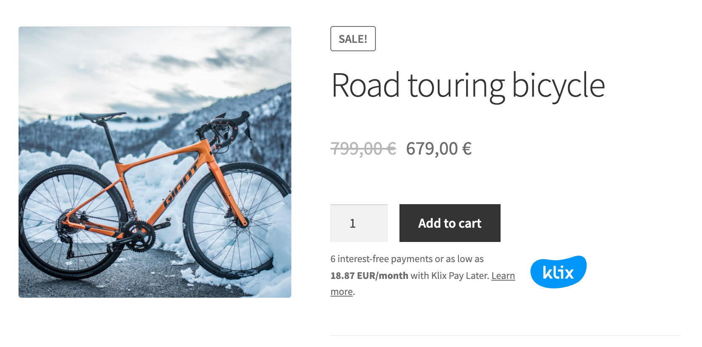

# Klix Pay Later widget

## Simple monthly payment widget

In order to add Klix Pay Later monthly payment widget to your store place following script in head part of the page.

```html
<head>
   <!-- Klix Pay Later widget -->
   <script type="module" src="https://klix.blob.core.windows.net/public/pay-later-widget/build/klix-pay-later-widget.esm.js"></script>
   <script nomodule="" src="https://klix.blob.core.windows.net/public/pay-later-widget/build/klix-pay-later-widget.js"></script>
</head>
```

Then place Klix Pay Later monthly payment widget source code just below the product price. You should pass at least product price, language and your Brand ID to widget.

```html
<body>
   ...
   <klix-pay-later amount="67900" brand_id="702314b8-dd86-41fa-9a22-510fdd71fa92" 
      language="en" theme="light" view="product" category="SPORTS_GOODS">
   </klix-pay-later>
   ...
</body>
```

For Shopify integration:

```html
<body>
   ...
   <klix-pay-later amount="{{ product.price | money_numbers_only}}" brand_id="702314b8-dd86-41fa-9a22-510fdd71fa92" 
      language="en" theme="light" view="product" category="SPORTS_GOODS">
   </klix-pay-later>
   ...
</body>
```



!!! Note "We strongly recommend to place Klix Pay Later monthly payment widget both on product, shopping cart and checkout page so that customer can preview monthly payment also if multiple different products are added to the shopping cart."

Widget parameters are described in the following table.

| Parameter      | Description                                                                                                                             | Optional |
|----------------|-----------------------------------------------------------------------------------------------------------------------------------------|----------|
| `amount`       | Product price in cents (if widget is shown in product view)/shopping cart item total amount in cents (if widget is shown in shopping cart/checkout view)  | false    |
| `brand_id`     | Brand ID assigned to your company after Klix agreement signing                                                                          | false    |
| `language`     | Widget language ( Latvia "en", "lv", "ru", Lithuania: "lt")                                  | false    |
| `theme`        | Currenly only "light" theme is supported                                                                                                | true     |
| `view`         | Widget placement in site. Following placements are supported: "product", "cart", "checkout".                                            | true     |
| `category`     | Product category. Should be specified only in case merchant sells different type of goods. Possible values: TV_HOME_APPLIANCES, CLOTHES_SHOES_ACCESSORIES, ELECTRONICS, COMPUTER_EQUIPMENT, FURNITURE, SPORTING_GOODS, GARDEN_GOODS, COSMETICS, CHILDREN_GOODS, CAR_GOODS, MOTO_GOODS, FOR_HOME_AND_REPAIR, ZOO_GOODS, GROCERIES_AND_ALCOHOL, BOOKS, MEDICAL_GOODS, GIFT_CARDS, DELIVERY, OTHER                                                                                                                       | true     |

Klix Pay Later monthly payment widget displays monthly payment information depending on a country, financing product type assigned to your merchant configuration.

Here are few examples of how Klix Pay Later monthly payment widget might look like in case of different financing product types:

* Monthly payment widget displaying grace i.e. Klix FREE financing product information for Latvian merchant
<!-- markdownlint-disable MD033 -->
<div style="margin: auto; width: 70%">
<klix-pay-later amount="75000" brand_id="a6cef80b-92a4-4bc2-b611-7dc597f9a000" language="en" theme="light" view="product" category="SPORTS_GOODS" class="hydrated">
</klix-pay-later>
</div>
<!-- markdownlint-disable MD033 -->

* Monthly payment widget displaying installment financing product information for Latvian merchant
<!-- markdownlint-disable MD033 -->
<div style="margin: auto; width: 70%">
<klix-pay-later amount="90000" brand_id="a6cef80b-92a4-4bc2-b611-7dc597f9a000" language="en" theme="light" view="product" category="SPORTS_GOODS" class="hydrated">
</klix-pay-later>
</div>
<!-- markdownlint-disable MD033 -->

* Monthly payment widget displaying commission financing product information for Latvian merchant
<!-- markdownlint-disable MD033 -->
<div style="margin: auto; width: 70%">
<klix-pay-later amount="50000" brand_id="a6cef80b-92a4-4bc2-b611-7dc597f9a000" language="en" theme="light" view="product" category="SPORTS_GOODS" class="hydrated">
</klix-pay-later>
</div>
<!-- markdownlint-disable MD033 -->

* Monthly payment widget displaying grace i.e. Klix FREE financing product information for Lithuanian merchant
<!-- markdownlint-disable MD033 -->
<div style="margin: auto; width: 70%">
<klix-pay-later amount="75000" brand_id="a6cef80b-92a4-4bc2-b611-7dc597f9a001" language="lt" theme="light" view="product" category="SPORTS_GOODS" class="hydrated">
</klix-pay-later>
</div>
<!-- markdownlint-disable MD033 -->

* Monthly payment widget displaying installment financing product information for Lithuanian merchant
<!-- markdownlint-disable MD033 -->
<div style="margin: auto; width: 70%">
<klix-pay-later amount="90000" brand_id="a6cef80b-92a4-4bc2-b611-7dc597f9a001" language="lt" theme="light" view="product" category="SPORTS_GOODS" class="hydrated">
</klix-pay-later>
</div>
<!-- markdownlint-disable MD033 -->

* Monthly payment widget displaying commission financing product information for Lithuanian merchant
<!-- markdownlint-disable MD033 -->
<div style="margin: auto; width: 70%">
<klix-pay-later amount="50000" brand_id="a6cef80b-92a4-4bc2-b611-7dc597f9a001" language="lt" theme="light" view="product" category="SPORTS_GOODS" class="hydrated">
</klix-pay-later>
</div>
<!-- markdownlint-disable MD033 -->

## Monthly payment widget with adjustable down-payment amount

In order to add Klix Pay Later monthly payment widget with adjustable down-payment amount to your store place following script in head part of the page.

```html
<head>
   <!-- Klix Pay Later widget with adjustable down-payment amount -->
    <script src="https://klix.blob.core.windows.net/public/pay-later-calculator-widget/build/klix-widget.esm.js"></script>
</head>
```

Then place Klix Pay Later monthly payment widget source code in desired place and pass data-brand-id, data-loan-amount and data-locale-attributes.

```html
<body>
   ...
   <klix-widget id="klix-custom-widget" data-brand-id="a6cef80b-92a4-4bc2-b611-7dc597f9a999" data-loan-amount="75000" data-locale="lv"></klix-widget>
   ...
</body>
```

Here are few examples of how Klix Pay Later monthly payment widget with adjustable down-payment amount might look like in case of different financing product types:

* Monthly payment widget displaying grace i.e. Klix FREE financing product information for Latvian merchant
<!-- markdownlint-disable MD033 -->
<div style="margin: auto; width: 70%">
<klix-widget id="klix-custom-widget" data-brand-id="a6cef80b-92a4-4bc2-b611-7dc597f9a999" data-loan-amount="75000" data-locale="lv"></klix-widget>
</div>
<!-- markdownlint-disable MD033 -->

* Monthly payment widget displaying multiple installment financing product information for Lithuanian merchant
<!-- markdownlint-disable MD033 -->
<div style="margin: auto; width: 70%">
<klix-widget id="klix-custom-widget" data-brand-id="a6cef80b-92a4-4bc2-b611-7dc597f9a998" data-loan-amount="75000" data-locale="lt"></klix-widget>
</div>
<!-- markdownlint-disable MD033 -->

## Monthly payment widget with custom view

This type of widget allows you to implement monthly payment widget that matches your web-page design. 
To enable monthly payment widget custom view you should set global variables `showCustomView` to `true` and provide implementation for following functions:

```html
<!DOCTYPE html>
<html lang='en'>
    <head>
        ...
        <!-- Klix Pay Later widget -->
        <script type="module" src="https://klix.blob.core.windows.net/public/pay-later-widget/build/klix-pay-later-widget.esm.js"></script>
        <script nomodule="" src="https://klix.blob.core.windows.net/public/pay-later-widget/build/klix-pay-later-widget.js"></script>
        <script type="application/javascript">
            window.showCustomView = true;
            window.customMiniWidget = {};
    
            window.customMiniWidget.populateData = function (data) {
                // This function will be called once monthly payment data is retrieved from Klix API.
                // data contains two fields: preferredOffer of type FinancingProduct and offers of type FinancingProduct[]:
                // data.preferredOffer is a preferred financing product offer determined by merchat configuration
                // data.offers is a list of all financing product offers available to this merchant
                this.monthlyPaymentAmount = data.preferredOffer.monthlyPaymentAmount;
                this.repaymentCount = data.preferredOffer.totalRepaymentCount;
            }
      
            window.customMiniWidget.returnWidgetView = function () {
                // This function should return string representation of HTML view of this custom design widget e.g. 
                return `
                <div>
                    <span>${this.repaymentCount} mēn. Х ${this.monthlyPaymentAmount}&nbsp;€</span>
                </div>`
            }
        </script>
    </head>
    <body>
        ...
        <klix-pay-later amount="75000" brand_id="a6cef80b-92a4-4bc2-b611-7dc597f9a000" language="en" theme="light" view="product" category="ELECTRONICS">
        </klix-pay-later>
    </body>
</html>
```

`FinancingProduct` class fields description:

| Parameter                   | Description                                                                                          | Type   |
|-----------------------------|------------------------------------------------------------------------------------------------------|--------|
| `id`                        | Financing product id                                                                                 | string |
| `requestedAmount`           | Total purchase amount e.g. 600 EUR                                                                   | number |
| `downPaymentAmount`         | Down-payment amount that will/must be paid by customer e.g. 100 EUR                                  | number |
| `principalAmount`           | Loan amount to be borrowed e.g. 600-100=500 EUR                                                      | number |
| `apr`                       | Annual percentage rate                                                                               | number |
| `commissionRate`            | Commission rate                                                                                      | number |
| `fixedCommission`           | Commission amount if product have fixed commission amount                                            | number |
| `interestRate`              | Interest rate                                                                                        | number |
| `gracePeriodRepaymentCount` | Grace period repayment count (only for product type GRACE_PERIOD)                                    | number |
| `totalRepaymentCount`       | Total loan repayment count                                                                           | number |
| `monthlySplitPaymentAmount` | Monthly payment amount if loan will be repaid within grace period                                    | number |
| `monthlyPaymentAmount`      | Monthly payment amount including all fees                                                            | number |
| `monthlyPaymentGraceAmount` | Monthly payment amount within grace period if extended term is chosen                                | number |
| `firstMonthPaymentAmount`   | First month payment amount for loan (monthly payment + commission fee in case of COMMISSION product) | number |
| `name`                      | Name of this financing product                                                                       | string |
| `productType`               | Type of this financing product. Possible values: `GRACE_PERIOD`, `INSTALLMENT_CREDIT`, `COMMISSION`  | string |
| `sequence`                  | Financing product sequence                                                                           | number | 
