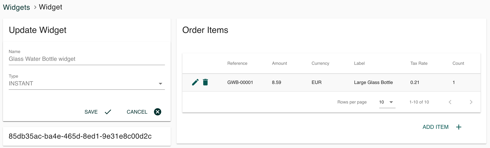

# Quick Start Guide

## 1. Get access to Klix Merchant Console

Klix Merchant Console is a self-service web-page for merchant and order data management.
In order to access Merchant Console contact [support@klix.app](mailto:support@klix.app?subject=Merchant%20onboarding%20request&body=Hello.%0D%0AWe would like to request access to Klix checkout solution.%0D%0AKlix Merchant Console and API will be accessed from following IP addresses on test environment: PLEASE_REPLACE_THIS_WITH_IP_ADDESS%0D%0AE-mail address to access Merchant Console: PLEASE_REPLACE_THIS_WITH_EMAIL_ADDRESS) and request merchant onboarding in Klix.
Make sure to specify IP address from which Klix solution will be accessed and e-mail address for logging into Merchant Console. Merchant Console invitation e-mail will be sent after request has been reviewed.

## 2. Decide which integration scenario suits you best

There are two types of integration scenarios currently supported by Klix. Choose one depending on a type of your existing web-shop:

1. Simple integration that's used in case if Klix is integrated with static homepage. For each product separate Klix Instant Widget should be created and widget's HTML code should be placed on merchant's product page. This integration type is suitable for rather small product catalog (up to 10 - 15 products).

2. More advanced integration that's used in case if Klix is integrated with custom built or standard e-commerce platform web-shop. Single Klix Checkout Widget can be created to handle multi-product shopping carts and unlimited product catalogs. This requires [callbacks](../callbacks/) implementation in merchant's web store.

## 3. Provide integration configuration in Merchant Console

Follow registration link in Merchant Console invitation e-mail and specify new password. After registration follow [these steps](../configuration/) to configure integration.

## 4. Add widget HTML code to your web-page

Add Klix Widget HTML code to your product or checkout page depending on a type of used widget (instant, checkout) and your web-shop specifics. More information about widget configuration can be found on [Widget](../widget/) page.

## 5. Implement callbacks

Callbacks should be implemented only in case if Klix Checkout Widget is used. Multiple [callbacks](../callbacks/) correspond to different order lifecycle phases.
Simple Klix Widget does not require implementing callbacks in your web-shop.

## 6. Implement order approval/decling API calls

In case of Klix Checkout Widget each order should be verified and either approved or declined by merchant's web-shop before actual payment is initiated. After customer has approved a payment Klix sends a callback to merchant's web-shop. Merchant's web-shop should perform order validation e.g. check that product prices are valid and products are still available in stock and either approve or decline this order via [Klix API](../api/).

## 7. Test integration

Klix provides fully functional test environment that can be used to perform end to end [integration implementation testing](../testing-integration/).

## 8. Sign agreement and request access to production environment

After integration has beed successfully tested on test environment you can proceed with creadentials request for production.
