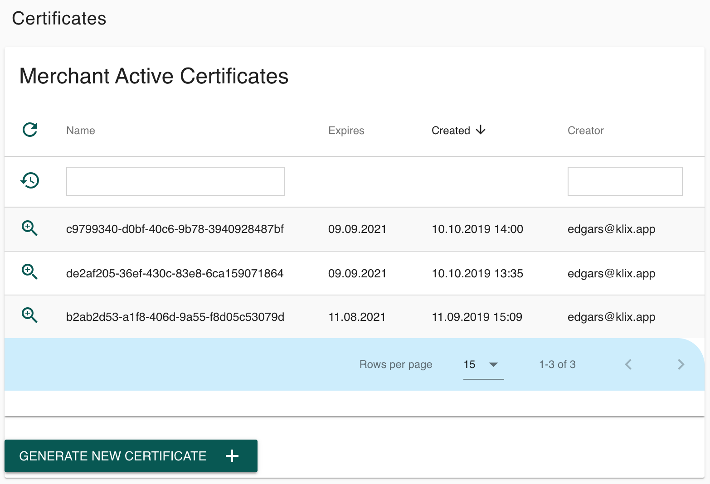
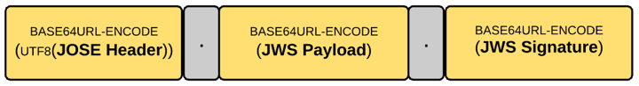

# Protocol Security

Every data modification request sent by merchant to KLIX should be signed by merchant private key and validated on KLIX side by merchant public key. It is important to use asymmetric cryptography algorithm to have non-disputable transactions in e-commerce. Especially in pricing and quotes area. Shared keys could be stolen from both parties thus making KLIX liable of potential data and financial losses.

## Transport-Level Security

All communication is going via HTTPS TLS 1.2 protocol. KLIX is using trusted certificates from  a well-known certificate authority.

In addition to TLS IP range limitation and redirect domain control is in place. 

## API Key

The very first level of Merchant API security is a shared API key. API key is generated for Merchant user and should be sent in HTTP header with every request. It allows identifying that requests are coming from legit user.

Name of the HTTP header to be used for submitting API Key is '_X-KLIX-Api-Key_'.

## JWS Signature

Private and public key pairs are issued by KLIX PKI (Public Key Infrastructure) server. It is possible to generate a new RSA 2048 key pair in Merchant Console -> Certificates page. When clicking “GENERATE NEW CERTIFICATE” private key is downloaded to user machine, and public key is kept in KLIX database.



JWS compact should be used for signing all REST API requests. A JSON Web Signature (abbreviated JWS) is an IETF-proposed standard [RFC7515] for signing arbitrary data.[^1]

[^1]: [https://en.wikipedia.org/wiki/JSON_Web_Signature](https://en.wikipedia.org/wiki/JSON_Web_Signature)



_“JWS compact serialization represents a signed JWT as a compact URL-safe string. This compact string has three main elements separated by periods (.): the JOSE header, the JWS payload and the JWS signature. If you use compact serialization against a JSON payload (or any payload — even XML), then you can have only a single signature, which is computed over the complete JOSE header and JWS payload.”[^2]_

[^2]: [https://medium.facilelogin.com/jwt-jws-and-jwe-for-not-so-dummies-b63310d201a3](https://medium.facilelogin.com/jwt-jws-and-jwe-for-not-so-dummies-b63310d201a3)

This is Java code[^3] example using Nimbus Jose JWT open source library. It generates an RSA private/public key pair and signs it with JWS signature. In real environment merchant API user would be using a private key generated from KLIX Merchant Console.

[^3]: [https://connect2id.com/products/nimbus-jose-jwt/examples/jws-with-rsa-signature](https://connect2id.com/products/nimbus-jose-jwt/examples/jws-with-rsa-signature)

```java
import com.nimbusds.jose.*;
import com.nimbusds.jose.crypto.*;
import com.nimbusds.jose.jwk.*;
import com.nimbusds.jose.jwk.gen.*;

// RSA signatures require a public and private RSA key pair,
// the public key must be made known to the JWS recipient to
// allow the signatures to be verified
RSAKey rsaJWK = new RSAKeyGenerator(2048)
    .keyID("123")
    .generate();
RSAKey rsaPublicJWK = rsaJWK.toPublicJWK();

// Create RSA-signer with the private key
JWSSigner signer = new RSASSASigner(rsaJWK);

// Prepare JWS object with simple string as payload
JWSObject jwsObject = new JWSObject(
    new JWSHeader.Builder(JWSAlgorithm.RS256).keyID(rsaJWK.getKeyID()).build(),
    new Payload("In RSA we trust!"));

// Compute the RSA signature
jwsObject.sign(signer);

// To serialize to compact form, produces something like
// eyJhbGciOiJSUzI1NiJ9.SW4gUlNBIHdlIHRydXN0IQ.IRMQENi4nJyp4er2L
// mZq3ivwoAjqa1uUkSBKFIX7ATndFF5ivnt-m8uApHO4kfIFOrW7w2Ezmlg3Qd
// maXlS9DhN0nUk_hGI3amEjkKd0BWYCB8vfUbUv0XGjQip78AI4z1PrFRNidm7
// -jPDm5Iq0SZnjKjCNS5Q15fokXZc8u0A
String s = jwsObject.serialize();

// To parse the JWS and verify it, e.g. on client-side
jwsObject = JWSObject.parse(s);

JWSVerifier verifier = new RSASSAVerifier(rsaPublicJWK);

assertTrue(jwsObject.verify(verifier));
assertEquals("In RSA we trust!", jwsObject.getPayload().toString());
``` 

JWS signed content should be used in all POST, DELETE, PUT requests to confirm data modification or financial operations such as Order. GET requests should not be signed with JWS. Key ID (kid) parameter should be taken from Merchant Console.


There are JWS libraries available for all common implementation platforms: PHP, Node.js, .NET, etc. Up-to-date list of implementation is available here [https://openid.net/developers/jwt/](https://openid.net/developers/jwt/).

Merchant RSA Key Pair generation guidelines:

* Each key pair is assigned a unique identifier in KIiX database;
* Merchant private key is not stored in KLIX and its responsibility of merchant to keep it secure;
* Key could be revoked by the merchant or KLIX admin at any time;
* Multiple keys could be active at the same time. JWS ‘_kid_’ parameter helps to identify which key is used in a particular request;
* Default Key expiration time is 2 calendar years. This is defined on PKI policies level;
* Notifications about key status changes (as well as expiration reminders) should be sent to merchant email address (and potentially SMS);

Requests going from KLIX to merchant defined callback URL are also signed digitally using KLIX private key and validated using public key, which is available in Merchant Console.

JWS signature content could be debugged inside online tool [https://jwt.io/](https://jwt.io/). Do not share your private key content online, since it will be compromised!
