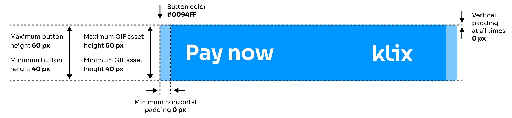
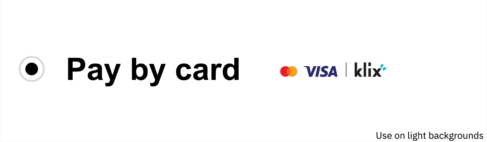
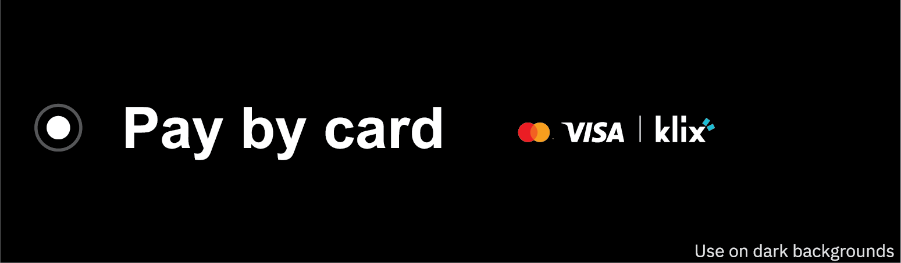
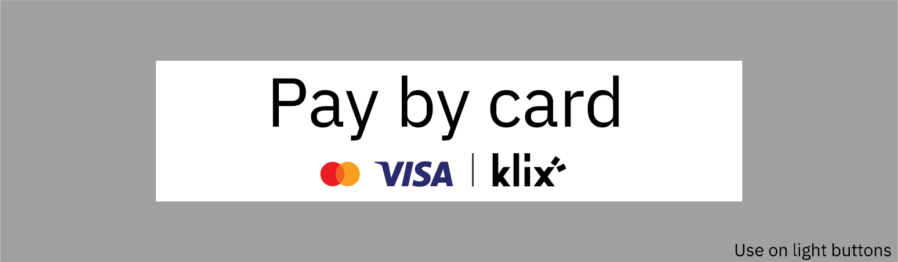
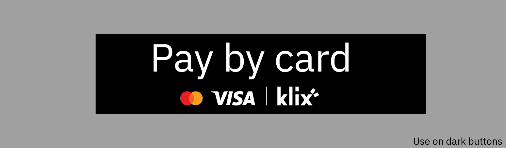
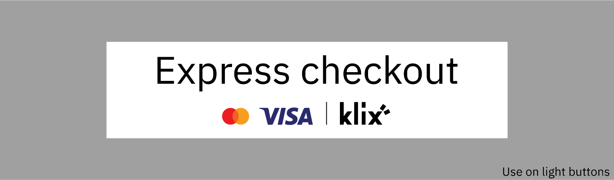
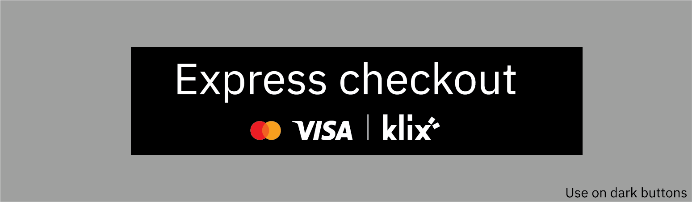

# Klix Pay and Klix Checkout assets for your store

## Asset usage guide

## 1. Klix Pay assets for Klix as one of your payment methods

1.1. Use assets without text - available for light or dark backgrounds.

<!-- markdownlint-disable MD033 -->

    

        
        
        
        <a href="../images/logos/pay-without-text/logo-dark.svg" style="display:block;font-size: 14px">Download asset</a>
    

    

        
        
        <a href="../images/logos/pay-without-text/logo-light.svg" style="display:block;font-size: 14px">Download asset</a>
    

1.2. Use assets for your buttons with white or black text: "Pay by card", available in LV, RU, EN.

<!-- markdownlint-disable MD033 -->

    

        
        
        
Download asset in <a href="../images/logos/pay-with-text/dark-text-lv.svg">LV</a>, <a href="../images/logos/pay-with-text/dark-text-ru.svg">RU</a>, <a href="../images/logos/pay-with-text/dark-text-en.svg">EN</a> languages

    

    

        
        
        
Download asset in <a href="../images/logos/pay-with-text/light-text-lv.svg">LV</a>, <a href="../images/logos/pay-with-text/light-text-ru.svg">RU</a>, <a href="../images/logos/pay-with-text/light-text-en.svg">EN</a> languages

    

## 2. Klix Checkout assets for Klix as your Express checkout solution

2.1 Use assets for your buttons with white or black text: "Express checkout", available in LV, RU, EN.

<!-- markdownlint-disable MD033 -->

    

        
        
        
Download asset in <a href="../images/logos/checkout/dark-text-lv.svg">LV</a>, <a href="../images/logos/checkout/dark-text-ru.svg">RU</a>, <a href="../images/logos/checkout/dark-text-en.svg">EN</a> languages

    

    

        
        
        
Download asset in <a href="../images/logos/checkout/light-text-lv.svg">LV</a>, <a href="../images/logos/checkout/light-text-ru.svg">RU</a>, <a href="../images/logos/checkout/light-text-en.svg">EN</a> languages

    

