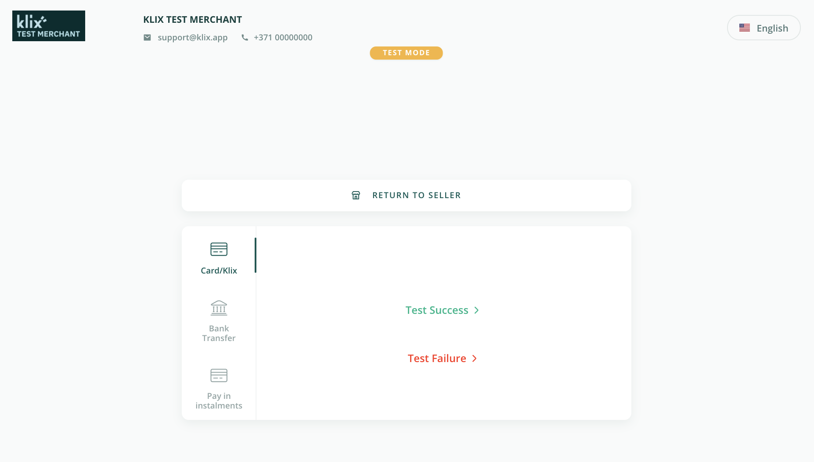

# Test environment API credentials

In order to preview Klix payment gateway card payment method and test integration implementation following test account API credentials can be used:

| Brand ID                                                  | Secret key                                                                                                     |
|-----------------------------------------------------------|----------------------------------------------------------------------------------------------------------------|
| 702314b8-dd86-41fa-9a22-510fdd71fa92| No51P_Dq4jQGeha6_eQpfjAFe67u3QYHEO95jrcCux0zPfByd8x9poSa6xINQPz1hyUGKNYoxa16rnUkSUI_MA==|

In case of Klix card and Klix Pay Later payment methods after redirecting customer to the Klix payment page (field "checkout_url" value from Purchase creation response) there's an option to choose either successful or failed payment scenario for testing purposes. In case of bank transfers only success scenario is supported in test environment.

