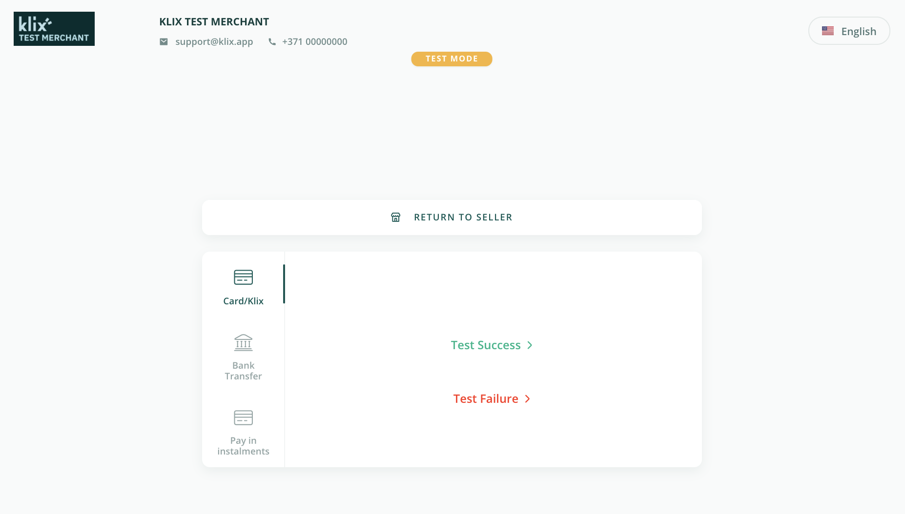

# Test environment API credentials

## Full payment flow integration testing

In order to perform full integration testing with specific payment methods, including regular card payments, recurring payments, reservations, Google Pay, and Swedbank sandbox payments, the following test account API credentials can be used:

| Brand ID                                                   | Secret key                                                                                                     |
| ---------------------------------------------------------- | -------------------------------------------------------------------------------------------------------------- |
| 702314b8-dd86-41fa-9a22-510fdd71fa92 | IB-bzOdJLgJjbsaA34Qpxkg1TTIrW-iDuni6JuzbP--KgtsREHzvIvLLTH8E5T0CZcSbYM3qNmfeogpWW_RZaA== |

This test account provides access to the following payment methods and scenarios:

* **Cards** – regular card payments, recurring payments, reservations, and Google Pay.
* **Multilink** – Swedbank sandbox.

The available payment methods are intentionally limited to allow developers to test the **full buyer flow** for the supported payment methods, including the payment process and webhook callbacks.

### Test cards

Specific test cards should be used for testing card payments:

| Issuer     | PAN                 | CVV | Expiry date | 3D Secure password |
| ---------- | ------------------- | --- | ----------- | ------------------ |
| VISA       | 4505 1312 3400 0029 | 123 | 06/28       | hint               |
| MASTERCARD | 5191 6312 3400 0024 | 583 | 06/28       | hint               |

Any cardholder name can be used with these cards.

Please try to make a payment with both cards in case payment with one of the cards fails.

## Simplified integration testing

In order to quickly preview Klix payment gateway functionality and test the integration implementation, the following test account API credentials can be used:

| Brand ID                                                   | Secret key                                                                                                     |
| ---------------------------------------------------------- | -------------------------------------------------------------------------------------------------------------- |
| 702314b8-dd86-41fa-9a22-510fdd71fa92 | No51P_Dq4jQGeha6_eQpfjAFe67u3QYHEO95jrcCux0zPfByd8x9poSa6xINQPz1hyUGKNYoxa16rnUkSUI_MA== |

This test account supports **all available payment methods** and is intended for simplified integration testing. It allows developers to:

* integrate and verify payment method **logos and names**;
* quickly test the payment method selection and checkout integration;
* test **webhook** implementation.

This account is intended for quick integration testing and does not provide the same full buyer-flow testing capabilities as the test account described in the **Full payment flow integration testing** section.

For Klix card payments, after redirecting the customer to the Klix payment page (`checkout_url` value from the Purchase creation response), there is an option to choose either a successful or failed payment scenario for testing purposes.

For bank transfers and Klix Pay Later, only the successful payment scenario is supported in the test environment.

